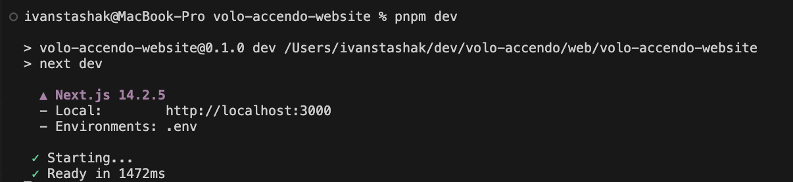

## Building and Running the App

The app's build system leverages the use of the package.json scripts and the order precedence for loading environment variables.
Note, that when next.js uses an order of precedence when it looks to load variables for runtime, which can be either development (next dev) or production runtime (next start).

The order of precedence is:

1. .env.development.local or .env.production.local
2. .env.local
3. .env.development or .env.production
4. .env

For example, if the app is run in development mode with the command "next dev", it will firs look for file .env.development.local. If this, is found the system will load those values into the environment variables and look no further. But, if .env.development.local isn't found next looks for the files in the order of the list, ending with .env last.
The same logic applies to running the app in production mode with the command "next start", where next first looks for .env.production.local and moves down the list if it is not present, ending with .env too.

Next, note that the files .env.development and .env.production were purposefully excluded from the project. Instead, .env.dev and .env.prod were added, which allows the build scripts in package.json to copy the environment variable values into the .env file.

```
// package.json scripts

...

"dev": "next dev",
"build": "cp .env.prod .env && next build",
"build:dev": "cp .env.dev .env && next build",
"build:prod": "pnpm build"
"start": "next start",

...
```

```
# .env.dev file

VOLO_ACCENDO_API="api.dev.voloaccendo.com"
NEXT_ENV="development"
```

```
# .env.prod file

VOLO_ACCENDO_API="api.voloaccendo.com"
NEXT_ENV="production"
```

### Example Build and Run

Let's see what happens when we build the app with the script "build:prod" and run it with the script "dev".

From the command line when we run **"pnpm build:prod"**, and we get:


Here we can see that the script "build:prod" references the script "build", which is a convenience script. Thus, "build:prod" and "build" can be used interchangeably.
The script "build" executes "cp .env.prod .env && next build", which copies the contents of .env.prod to .env

Inspecting .env we see that is has the following content:

```
# copied .env.prod file contents

VOLO_ACCENDO_API="api.voloaccendo.com"
NEXT_ENV="production"
```

Here, two environment variables, VOLO_ACCENDO_API and NEXT_ENV, have been configured to load when the app runs.

Now, from the command line type **"pnpm dev"** (equivalent to simply running "next dev"), and we get:


We start the application in development mode, as the script "pnpm dev" executes "next dev". (Again, the two commands can be used interchangeably, I've simply configured my build scripts such that I never have to use the "next" command.)

We can see that next finds the environment variables found only in the .env file as we have excluded all the other .env files that next looks to for setting environment variables, as discussed above. Finally, next's development environment starts and is ready, but is pointing to the production backend rather than the development back around.

Note, the same thing could have been done in vice versa fashion if, **"pnpm build:dev"** and **"pnpm start"**, were called respectively. In that case the .env.dev file would have been copied to the .env file, configuring the environment variables to point to the development backend. And, next would have been started in production mode.

### Conclusion

By using a combination of build scripts and .env files we are able to create a flexible work around for building and running the next app, such that the app can be run in either development or production mode while also pointing to any backend we'd like.
